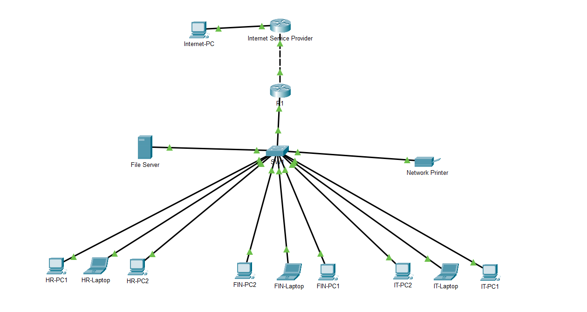
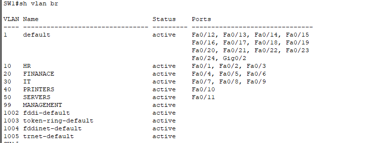
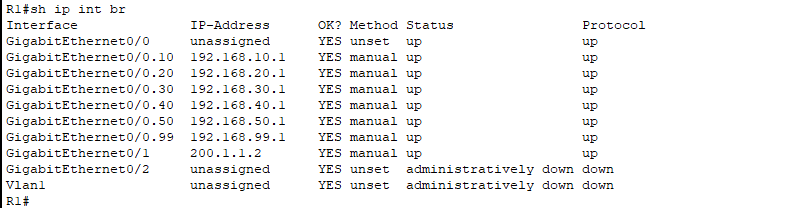
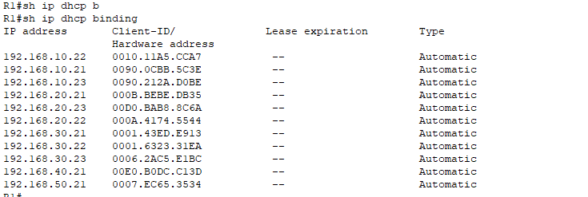
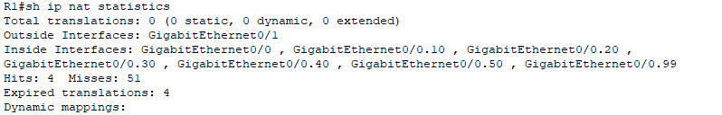
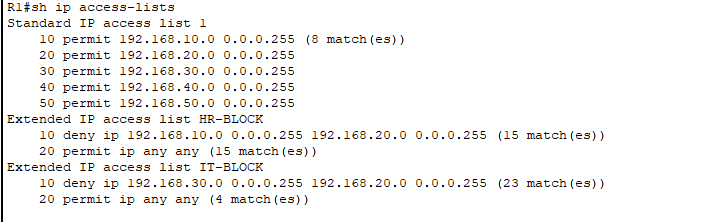
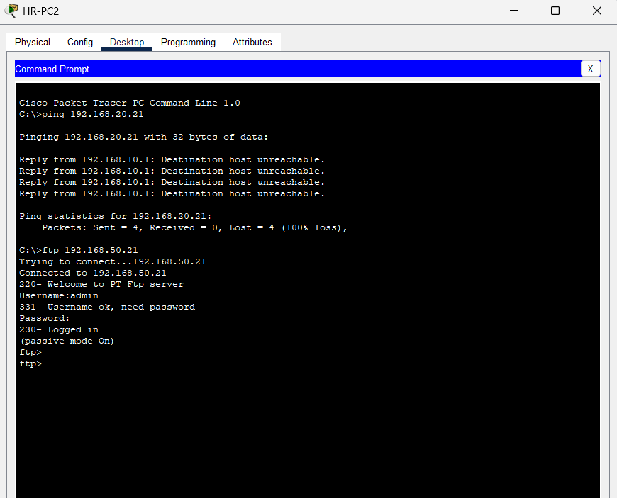
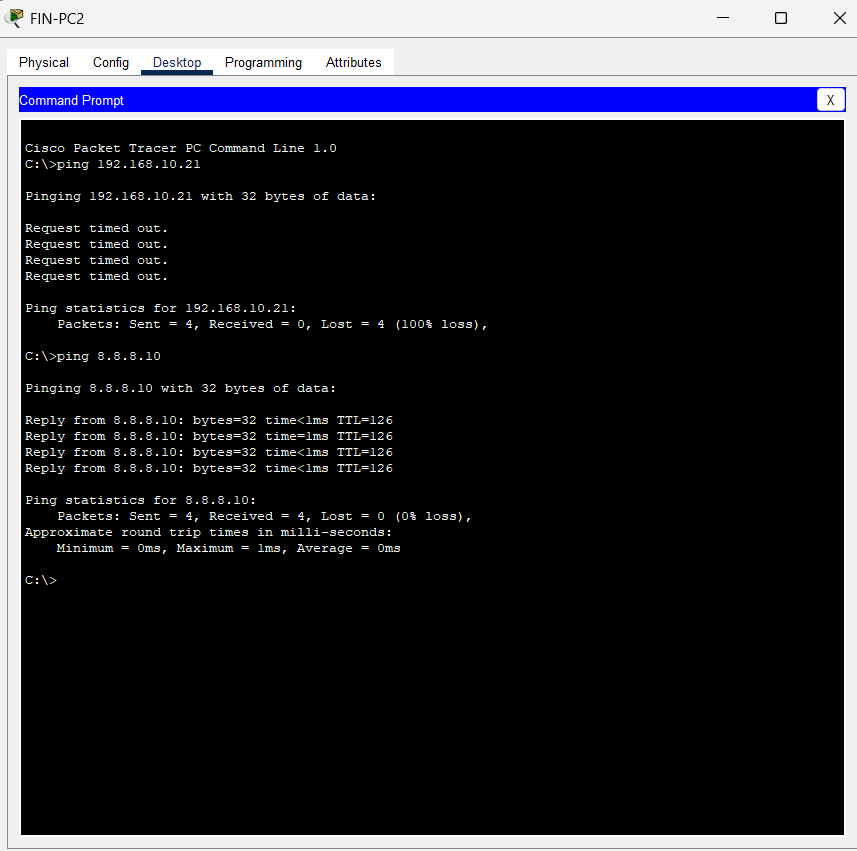

# 🏢 SME Network Design

<div align="center">


**A fully functional SME network simulation featuring multi-department segmentation, internet connectivity via NAT/PAT, centralized FTP services, and finance-layer security — built in Cisco Packet Tracer.**

</div>

---

## 📌 Project Overview

This project simulates a **Small and Medium Enterprise (SME)** network environment designed to support multiple departments with secure communication, centralized services, dynamic IP addressing, and internet connectivity.

The architecture reflects common technologies and responsibilities encountered by **Network Support Engineers** and **Network Administrators** in real-world SME environments.

> 💡 *Every component was configured from scratch using Cisco IOS, verified with show commands, and tested end-to-end — including inter-VLAN communication, NAT translation, FTP access, and ACL enforcement.*

---

## 🗺️ Network Topology

 

---

### Device Inventory

| Device | Role |
|--------|------|
| **R1** | Enterprise Router · DHCP Server · NAT/PAT · Inter-VLAN Routing |
| **ISP Router** | Internet simulation |
| **SW1** | Layer 2 Switch · VLAN segmentation · Trunk to R1 |
| **FTP Server** | Centralized file storage · Config backup simulation |

---

## 🔌 VLAN Design & IP Addressing

### VLAN Segmentation

| VLAN ID | Department | Network | Default Gateway |
|---------|-----------|---------|----------------|
| **10** | HR | `192.168.10.0/24` | `192.168.10.1` |
| **20** | Finance | `192.168.20.0/24` | `192.168.20.1` |
| **30** | IT | `192.168.30.0/24` | `192.168.30.1` |
|**40**|PRINTERS|`192.168.40.0/24`| `192.168.40.1` |
| **50** | SERVERS | `192.168.50.0/24` | `192.168.50.1` |
| **99** | MANAGEMENT | `192.168.99.0/24` | `192.168.99.1` |

### WAN & Management Addressing

| Device | Interface | IP Address |
|--------|-----------|-----------|
| R1 | G0/1 (WAN) | `200.1.1.2/30` |
| ISP | G0/0 | `200.1.1.1/30` |
| SW1 | VLAN 99 SVI | `192.168.99.2` |

---

## ⚙️ Technologies Implemented

### 1. 🔲 VLAN Segmentation
Five VLANs isolate departmental traffic, reducing broadcast domains and creating a foundation for granular access control.

### 2. 🔄 Inter-VLAN Routing — Router-on-a-Stick
IEEE 802.1Q subinterfaces on R1 enable controlled communication between VLANs over a single trunk link, eliminating the need for a Layer 3 switch.

### 3. 📡 DHCP
R1 serves as the centralized DHCP server, dynamically assigning IP address, subnet mask, default gateway, and DNS to all department hosts.

### 4. 🌐 NAT/PAT
Port Address Translation on R1 maps all private internal addresses to the single public WAN IP (`200.1.1.2`), enabling full internet connectivity for all VLANs.

### 5. 📁 FTP Server
A dedicated FTP server deployed within the Server VLAN simulates centralized enterprise file storage, supporting user authentication, file access control, and cross-VLAN service access.

### 6. 🔒 Access Control Lists (ACLs)
Extended ACLs protect the Finance VLAN from unauthorized access by HR and IT departments, enforcing departmental boundaries at the routing layer.

### 7. 📋 Management VLAN (VLAN 99)
Network administration traffic is isolated to VLAN 99, keeping management access separate from user data and accessible only via authorized hosts.

---

## 🛡️ Security Design

The Finance VLAN holds sensitive departmental resources and is protected by extended ACLs applied at the subinterface level on R1.

### Access Control Policy

| Source | Destination | Policy | Reason |
|--------|------------|--------|--------|
| HR | Finance | ❌ Denied | Prevent cross-department data access |
| IT | Finance | ❌ Denied | Finance resources restricted to Finance staff |
| HR | IT | ✅ Allowed | Internal collaboration permitted |
| IT | HR | ✅ Allowed | IT support access to HR systems |
| All VLANs | FTP Server | ✅ Allowed | Centralized file service for all departments |
| All VLANs | Internet | ✅ Allowed | General internet access via NAT/PAT |

> The Finance VLAN is isolated from both HR and IT to reflect real-world segregation of sensitive financial data — a common requirement in SME compliance and security policies.

---

## 🖼️ Verification Screenshots

| Feature | Screenshot |
|---------|-----------|
| VLAN Verification |  |
| Inter-VLAN Routing |  |
| DHCP Bindings |  |
| NAT Verification |  |
| ACL Verification |  |
| FTP Access |  |
| Internet Connectivity |  |

---

## 🔎 Key Verification Commands

```bash
show vlan brief                    # Verify VLAN database and port assignments
show interfaces trunk              # Confirm trunk link and allowed VLANs
show ip dhcp binding               # View dynamically assigned addresses
show ip nat translations           # Verify NAT/PAT translation table
show access-lists                  # Inspect ACL entries and hit counts
show ip interface brief            # Confirm subinterface states on R1
```

---

## 🐛 Troubleshooting Methodology

| Component | Validation Method |
|-----------|------------------|
| VLANs | VLAN membership and port assignment verification |
| Trunk Links | Trunk status and allowed VLAN confirmation |
| DHCP | Lease allocation verification per VLAN |
| Inter-VLAN Routing | Gateway reachability and cross-VLAN ping tests |
| NAT/PAT | Translation table inspection and internet ping |
| ACLs | Access validation and hit counter confirmation |
| FTP | Authentication test and file access from multiple VLANs |

---

## 🧠 Skills Demonstrated

`VLAN Design` · `Inter-VLAN Routing` · `Router-on-a-Stick` · `DHCP` · `NAT/PAT` · `FTP Deployment` · `Extended ACLs` · `Network Security` · `WAN Connectivity` · `Cisco IOS CLI` · `Network Troubleshooting` · `Technical Documentation`

---
<div align="center">

*Designed and implemented as a practical demonstration of SME enterprise networking concepts commonly encountered in network support and administration roles.*

</div>
